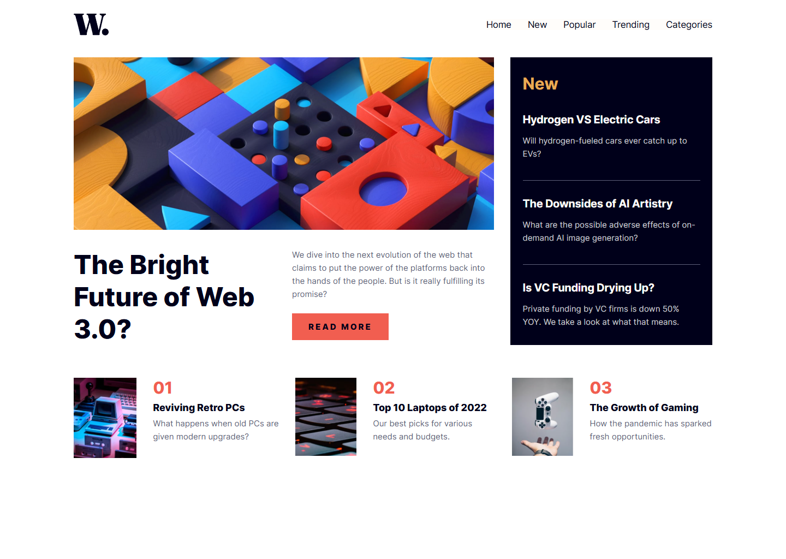
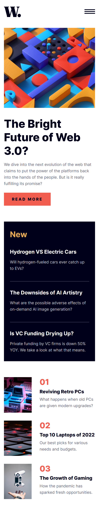

# Frontend Mentor - News homepage solution

This is a solution to the [News homepage challenge on Frontend Mentor](https://www.frontendmentor.io/challenges/news-homepage-H6SWTa1MFl). Frontend Mentor challenges help you improve your coding skills by building realistic projects.

## Table of contents

- [Overview](#overview)
  - [The challenge](#the-challenge)
  - [Screenshot](#screenshot)
  - [Links](#links)
- [My process](#my-process)
  - [Built with](#built-with)
  - [Continued development](#continued-development)
- [Author](#author)
- [Acknowledgments](#acknowledgments)

## Overview

### The challenge

Users should be able to:

- View the optimal layout for the interface depending on their device's screen size
- See hover and focus states for all interactive elements on the page

### Screenshot

### Links

- Solution URL: [Add solution URL here](https://github.com/ibrahimmurad/news-homepage)
- Live Site URL: [Add live site URL here](https://ibrahimmurad.github.io/news-homepage/)

## My process

### Built with

- Semantic HTML5 markup
- CSS custom properties
- Flexbox
- CSS Grid
- Mobile-first workflow
- Sass
- Vanilla JavaScript

### Continued development

In future projects, I want to focus more on:

- Optimizing for accessibility
- Improving animation techniques
- Implementation of more advanced JavaScript features

## Author

- [Email](mailto:ibrahimmorad31@gmail.com)
- [LinkedIn](https://www.linkedin.com/in/ibrahim-morad-228410209/)
- [Frontend Mentor](https://www.frontendmentor.io/profile/IbrahimMurad)
- [Github](https://github.com/ibrahimmurad/)
- [Discord](https://discord.com/users/ibrahimmorad)

## Acknowledgments

Thanks to Frontend Mentor for providing this challenge and helping developers improve their skills through practical projects.
